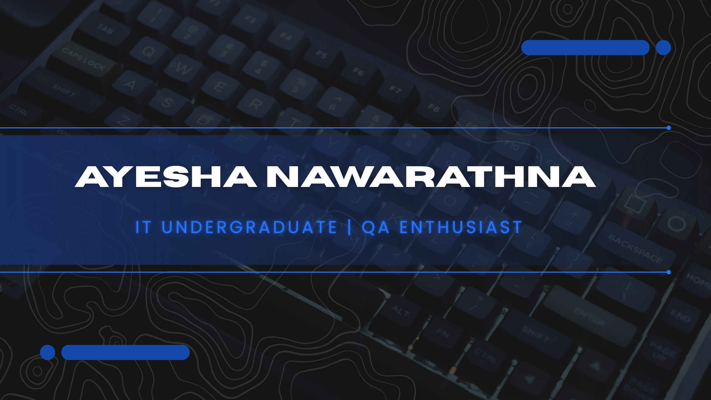

              <h1 align="center">👋 Open to Internship Opportunities</h1>          
____________________________________________________________________________________________________

<p align="center">
  
</p>
 
 🌸 About Me
```yaml
name: Ayesha Nawarathna
location: Sri Lanka 🇱🇰
university: Horizon Campus
degree: IT Undergraduate
status: Open for Internship Opportunities

💡 Interests
- Full-Stack Development  
- Machine Learning & AI  
- Backend Development  
- Software Quality Assurance (QA)

🧪 QA / Testing Skills
- Manual Testing  
- Test Case Writing  
- Bug Reporting  
- Basic Knowledge of Automation Testing  
- SDLC & STLC Concepts  

🚀 Currently
- Building projects  
- Learning QA & Testing tools  
- Improving coding skills  


📫 Contact Me
📧 Email:ayeshanawarathna90@gmail.com
## 📊 GitHub Stats

